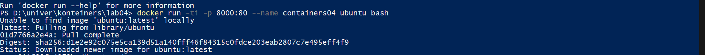
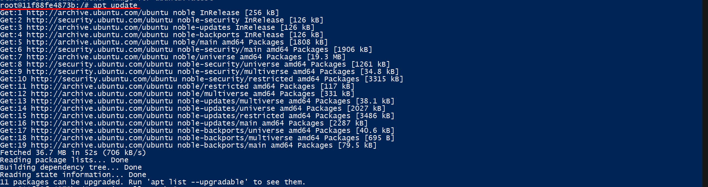
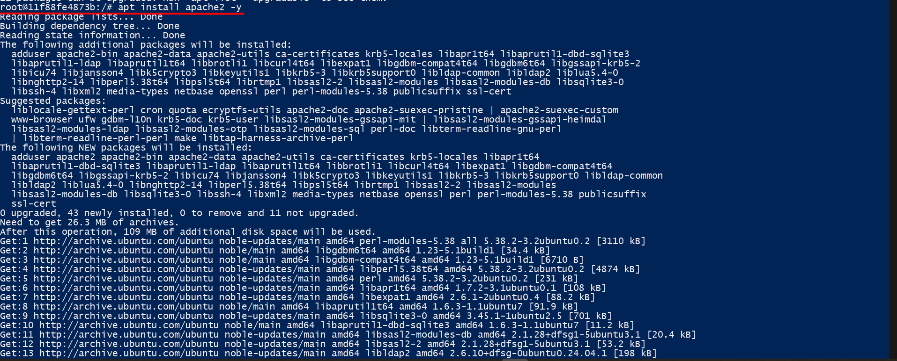
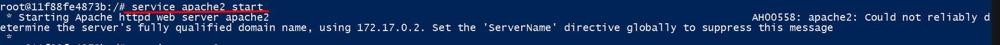
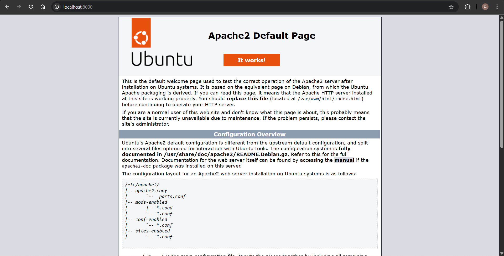
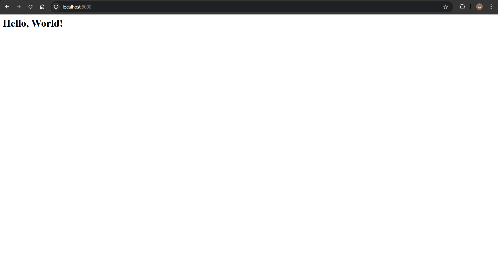
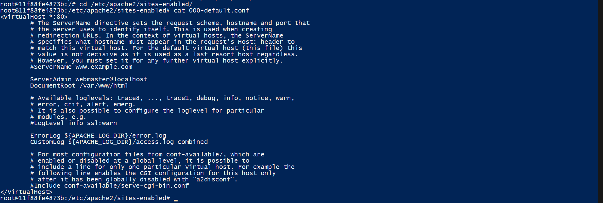
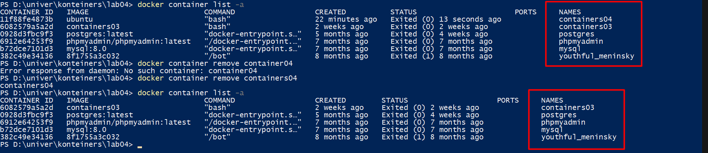

## Лабораторная работа №4 Использование контейнеров как среды выполнения

## Студент : Борисенко Дарья
## Группа : IA2403
## Дата выполнения 13.03.2026 

## Цель работы: 
Необходимо было запустить контейнер в среде Docker на базе образа Ubuntu. Установить и настроить веб-сервер Apache внутри контейнера, выполнить его запуск и проверить правильность его работы через веб-браузер.Требовалось ознакомиться с командами управления пакетами (apt update, apt install), изучить структуру каталогов веб-сервера Apache, изменить содержимое стандартной веб-страницы сервера, а также просмотреть и проанализировать конфигурационный файл виртуального хоста. Кроме этого, необходимо было ознакомиться с командами взаимодествия с контейнерами Docker.

## Ход работы: 

Открываем терминал и выполняем команду : 
`docker run -ti -p 8000:80 --name containers04 ubuntu bash` 

где: 
- `docker run` - создать и запустить контейнер 
- `-t` - создает псевдотерминал внутри контейнера 
- `-i` - позволяет делать ввод с клавиатуры внутри контейнера
- `-p 8000:80` - опция проброса портов, 8000 порту хоста соответствует 80 порт контейнера
- `--name containers04` - задает имя контейнера 
-`ubuntu` - образ, на базе которого поднимется контейнер(мы его подкачиваем из docker hub)
-`bash` - подключает внутри него баш оболочку 



В открывшимся окне выполняем следующие команды: 
```bash
apt update
apt install apache2 -y
service apache2 start
```

где: 

- `apt update` - обновления списка пакетов( обновления информации о них)
- `apt install apache2 -y` - скачивает и устанавливает пакеты апаче, без подтверждения от пользователя `-y`
- `service apache2 start` - запуск сервиса apache2





Открываем браузер и вводим в адресную строку:
http://localhost:8000

видим что все удачно установилось:


Далее выполняем следующие команды: 

```bash
ls -l /var/www/html/
echo '<h1>Hello, World!</h1>' > /var/www/html/index.html
```

где: 

- `ls -l /var/www/html/` - выводит список и подробную информацию о директории `/var/www/html/`
- `echo '<h1>Hello, World!</h1>' > /var/www/html/index.html` - создаем тег h1 с содержимым Hello, World! внутрь файла index.html

Обновляем страницу и видим результат, сообщение: Hello, World!



Далее выполняем следующие команды: 
```bash
cd /etc/apache2/sites-enabled/
cat 000-default.conf
```

где: 

- `cd /etc/apache2/sites-enabled/` - переход в другую директорию 
- `cat 000-default.conf` - выводит содержимое файла с конфигурацией



Закрываем процесс командой exit.Далее просматриваем список контейнеров командой: 
`docker container list -a` . Видим список всех контейнеров. После чего командой `docker container remove containers04` удаляем контейнер containers04 и просматриваем 



Библиография: 

[moodle](https://elearning.usm.md/mod/assign/view.php?id=282882)
